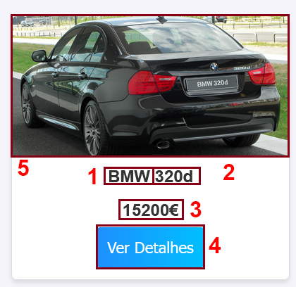
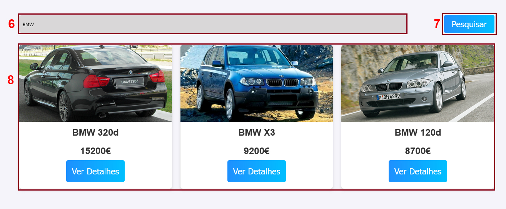
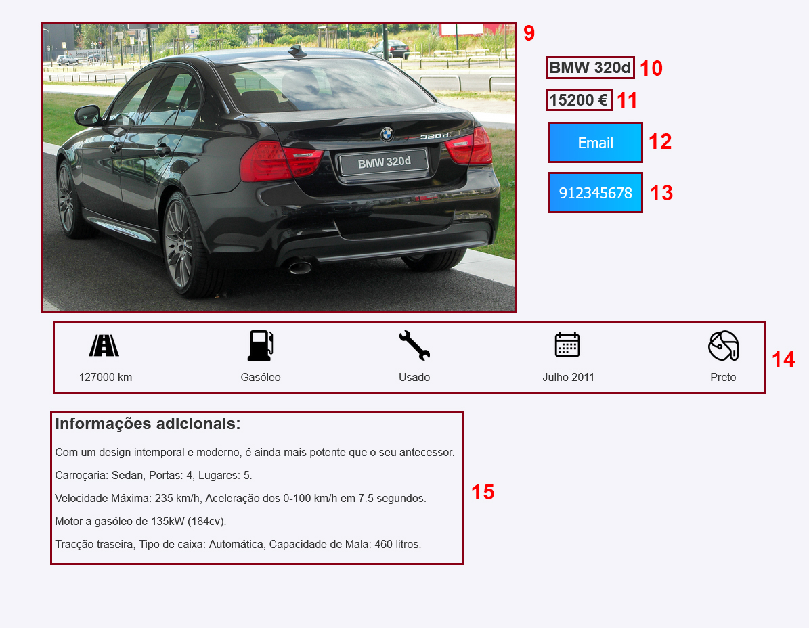
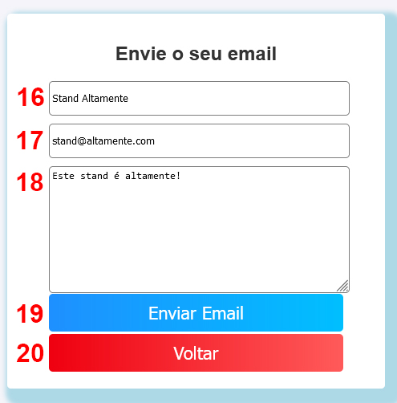
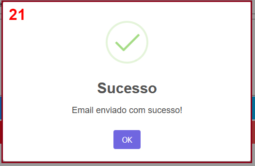
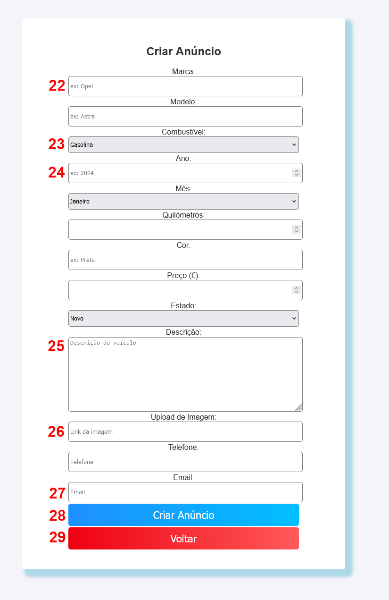
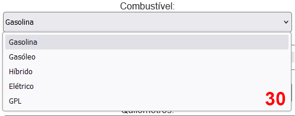

<!-- Fazer a documentação do projeto aqui -->
# Stand Altamente

O Stand Altamente é uma plataforma online para a criação e visualização de anúncios automóveis. Esta plataforma tem uma página principal (de entrada) onde é possível visualizar os diversos automóveis disponíveis, assim como efetuar uma pesquisa se o mesmo for pretendido. É também possibilitado ao utilizador aceder a outra página onde poderá criar o seu próprio anúncio, que, se concluído com sucesso, será também ele disponibilizado na página principal.


## 📌 **Funcionalidades**

### 1. **Página Principal - Catálogo de Veículos Disponíveis**
A página principal disponibiliza a lista completa de automóveis anunciados no stand. Cada anúncio apresenta algumas informações básicas sobre o anúncio em questão, sendo estas:
   - Marca do automóvel (1)
   - Modelo do automóvel (2)
   - Preço (3)
   - Imagem/fotografia do automóvel (4)

Cada anúncio disponível na página principal inclui um botão (5) que (caso seja premido) o redirecionará para o anúncio em questão, disponibilizando assim mais informações sobre o veículo.



Caso o utilizador procure algo em particular é possível utilizar o menu de pesquisa (6) presente na mesma página, possibilitando assim filtrar os veículos (7) por:
   - Marca
   - Modelo
   - Ano
   - Combustível
   - Estado
   - Cor

Caso existam veículos correspondentes, a página irá listar todos os veículos correspondentes com a pesquisa (8).




### 2. **Detalhes do Veículo**
Esta página apresenta a versão detalhada do anúncio que o utilizador selecionou para visualização. Esta página inclui os detalhes do anúncio presentes na página inicial:
   - Imagem/fotografia, de maior dimensão quando comparada com a apresentada na página principal, estando contudo dependente da resolução do dispositivo do utilizador (9)
   - Marca do automóvel (10)
   - Modelo do automóvel (10)
   - Preço (11)

Encontram-se também disponíveis mais informações sobre o veículo do anúncio, informações estas anteriormente não visíveis para o utilizador:
   - Algumas das informações mais importantes como o estado e combustível do veículo têm os seus próprios ícones para que sejam mais facilmente encontrados (14)
   - Uma descrição (15), redigida pelo anunciante, permitindo partilhar algo que considere pertinente, ou simplesmente adicionar mais informações sobre o veículo que não se encontrem sobre a alçada dos anteriores pontos

Esta página tem ainda 2 botões para contactar o vendedor:
   - Email (12), que o redireciona para uma nova página onde poderá contactar o anunciante via email
   - Telefone (13), que, ao clicar, irá automaticamente copiar o número, evitando assim a necessidade de o memorizar



### 3. **Contactar Vendedor/Anunciante**
Esta página foi criada para facilitar o contacto entre o utilizador e o anunciante.
O utilizador será redirecionado para esta página após premir o botão (12) presente na página de detalhes do veículo
A página contém um pequeno formulário que o utilizador poderá preencher para realizar o contacto:
   - Nome do utilizador (16)
   - Email do utilizador (17)
   - Texto que pretende enviar ao anunciante (18)
   - Botão para enviar o email (19)
   - Botão para voltar (retornar) à pagina anterior (20)

Finalizado o preenchimento e envio, a página irá alertar o utilizador para a conclusão da operação.






### 4. **Criação de anúncio**
A plataforma permite que os utilizadores criem os seus próprios anúncios através do preenchimento dum formulário. Este formulário tem diversos tipos de campos, tais como:
   - Campos de texto, tal como é o caso da marca do automóvel (22)
   - Campos de seleção, como é o caso do combustível (23), tendo este campo um leque de opções para escolher (30)
   - Campos númericos, como é o caso do "Ano" (24), com valores mínimos e máximos
   - A descrição (25) permite ao anunciante adicionar informações adicionais que considere pertinentes
   - O campo (26) permite ao utilizador adicionar uma imagem, colocando um link da mesma
   - O campo de email (27) tem também ele validação, esperando receber um endereço de email válido

É importante realçar que o preenchimento dos diversos campos do formulário é de carácter obrigatório, e que o não preenchimento de qualquer um dos campos presentes no mesmo resultará na falha da criação do anúncio, juntamente com uma mensagem a realçar o primeiro campo de carácter obrigátorio não preenchido.
Caso deseje abortar a criação do anúncio poderá pressionar o botão de "Voltar" (29) e será retornado à página em que se encontrava previamente.





Caso o formulário tenha sido corretamente preenchido, poderá pressionar o botão de criar anúncio (29), irá ser apresentada uma mensagem de sucesso (31)


### 5. **Sobre Nós**
A plataforma conta ainda com uma página "Sobre Nós" (32) que contém algumas informações relativas à origem da plataforma, assim como alguns dos seus objetivos e futuros funcionalidades da plataforma.


## 🖥️ **Arquitetura Tecnológica**

O projeto utiliza uma stack tecnológica moderna, conforme descrito abaixo:

- **Frontend:** Construído com HTML, CSS e JavaScript para oferecer uma interface responsiva e amigável ao utilizador.
- **Backend:** Implementado em Node.js utilizando o framework Express, responsável por gerir as rotas, a lógica de negócio e as interações com o banco de dados.
- **Banco de Dados:** MongoDB é utilizado como sistema de armazenamento não-relacional para garantir flexibilidade e escalabilidade no gerenciamento dos dados dos veículos.


## 📁 **Estrutura do Projeto**
A organização dos arquivos do projeto segue a seguinte disposição:
```
Stand_Altamente/
|-- assets/
|   |-- automoveis/
|   |-- icons/
|   |-- prints/
|   |-- logo.jpg
|   |-- menu-aberto(1).png
|   |-- showroom.jpg
|
|-- automoveis.js
|-- contactarVendedor.html
|-- criarAnuncio.html
|-- criarVeiculo.js
|-- detalhesVeiculo.css
|-- detalhesVeiculo.html
|-- enviarEmail.js
|-- index.html
|-- README.md
|-- script.js
|-- sobreNos.html
|-- style.css
|
```


## 📈 **Evolução e Melhorias Futuras (Roadmap)**

Tendo em consideração a contínua evolução da plataforma, têm-se como próximos objetivos os seguintes aspetos :

- Implementação de um sistema de registo dos utilizadores, desbloqueando novas funcionalidades na plataforma
- Permitir aos utilizadores registados editarem ou excluírem os anúncios criados pelos próprios
- Criação de uma página de pesquisa dedicada, permitindo aos utilizadores utilizarem vários filtros em simultâneo, permitindo assim uma pesquisa mais eficiente
- Possibilidade de adicionar/remover aos favoritos


🚀 **Desenvolvido por [ Diogo Mata | Diogo Consciência | Miguel Cruz ]**
